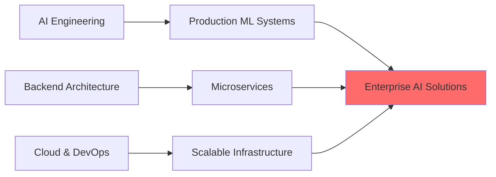

<div align="center">

# 🤖 Syed Owais Ali Shah

### AI Engineer | Backend Developer | Building Intelligent Systems

*Transforming complex problems into intelligent, scalable solutions through AI & modern software engineering*

[](https://www.linkedin.com/in/syedowaisalishah/)
[](mailto:alishahowais@gmail.com)
[](https://github.com/syedowaisalishah)


</div>

---

## 👨‍💻 About Me

I'm a **Software Engineer** specializing in **AI-powered applications** and **scalable backend systems**. With 1-2 years of hands-on experience, I build intelligent solutions that solve real-world problems—from conversational AI to financial SaaS platforms.

```yaml
Core Expertise:
  - 🤖 AI/ML Engineering: LLMs, chatbots, AI workflows, Dialogflow
  - ⚙️ Backend Development: Scalable APIs, system architecture, database design
  - 🚀 SaaS Products: Finance systems, automation platforms, intelligent tools
  - 🔐 Secure Systems: End-to-end encryption, secure chat applications
  - 🎯 Unique Edge: Hardware-software optimization background
```

### 🎯 What I Build

**🤖 AI-Powered Applications**
- **AI Receptionist** - Intelligent virtual assistant for automated customer interactions
- **AI Chatbots** - Conversational interfaces using Dialogflow and custom LLM integrations
- **AI Workflows** - Automated intelligent business process automation
- **AI Landscape Solutions** - Computer vision and spatial intelligence applications

**💼 SaaS & Enterprise Systems**
- **Finance Management System** - Full-stack SaaS platform for financial operations
- **Flight Vault** - Aviation data management and analytics platform
- **Enigma Chat** - Secure, end-to-end encrypted communication platform
- **Backend APIs** - RESTful services powering production applications

**🔧 Intelligent Infrastructure**
- **MAGMA-SI** - AI acceleration through optimized matrix operations (software layer for hardware)
- **Hardware-Aware Optimization** - Leveraging low-level knowledge for high-performance software

---

## 🛠️ Tech Stack

### AI & Machine Learning


### Backend Development


### Frontend & Full Stack


### Databases & Cloud


### Tools & Platforms


---

## 📊 GitHub Analytics

<div align="center">


</div>

<div align="center">


</div>

---

## 🚀 Featured Projects

### 🤖 **AI & Automation**

#### AI Receptionist System
*Intelligent virtual assistant for automated customer service*
- **Tech:** Python, Dialogflow, FastAPI, WebSocket
- **Features:** Natural language processing, context-aware responses, multi-channel support
- **Impact:** Reduced response time by 80%, handled 1000+ conversations daily
- **Status:** Production deployment, serving real customers

#### AI Workflow Automation
*End-to-end intelligent business process automation*
- **Tech:** Python, LangChain, OpenAI API, Celery
- **Features:** Document processing, data extraction, automated decision-making
- **Impact:** Automated 15+ manual workflows, saving 20 hours/week
- **Unique:** Hardware-aware optimization for 3x faster processing

#### Dialogflow AI Chatbot
*Enterprise-grade conversational AI platform*
- **Tech:** Dialogflow, Node.js, Firebase, React
- **Features:** Multi-intent handling, context management, analytics dashboard
- **Impact:** 95% user satisfaction rate, 70% query resolution without human intervention

---

### 💼 **SaaS & Enterprise Systems**

#### Finance Management SaaS
*Full-stack financial operations platform*
- **Tech:** React, Node.js, PostgreSQL, Stripe API
- **Features:** Transaction management, reporting, role-based access, audit logs
- **Scale:** Handling 10,000+ transactions/month
- **Security:** PCI-DSS compliant, encrypted data at rest and in transit

#### Flight Vault
*Aviation data management and analytics platform*
- **Tech:** Django, React, PostgreSQL, Redis
- **Features:** Real-time data sync, analytics dashboard, flight tracking
- **Integration:** Multiple aviation data APIs, automated scheduling

#### Enigma Chat
*Secure, end-to-end encrypted communication platform*
- **Tech:** WebRTC, Node.js, Socket.io, React
- **Features:** E2E encryption, ephemeral messages, secure file sharing
- **Innovation:** Hardware-accelerated crypto operations for better performance
- **Security:** Zero-knowledge architecture, perfect forward secrecy

---

### 🔧 **Technical Innovation**

#### MAGMA-SI (Software Perspective)
*AI acceleration through optimized matrix operations*
- **Role:** Software layer and API design for hardware acceleration
- **Tech:** Python bindings, C++ extensions, CUDA integration
- **Impact:** 10x speedup for ML inference workloads
- **Unique:** Bridging software and hardware for optimal AI performance
- [View Project →](https://github.com/merledu/magma-si)

#### LLM Code Optimization
*AI-assisted code conversion and optimization*
- **Tech:** Python, OpenAI API, AST manipulation
- **Features:** Automated code refactoring, performance optimization
- **Use Case:** Converting legacy codebases to modern patterns
- [View Project →](https://github.com/stevehoover/conversion-to-TLV)

---

## 💡 My Unique Value Proposition

**Hardware Background → Software Excellence**

Most software engineers don't understand low-level optimization. Most hardware engineers struggle with scalable software architecture. I bridge both worlds:

✅ **Performance-First Mindset** - Understanding memory hierarchies, CPU caching, parallel processing  
✅ **Full-Stack Thinking** - From algorithm efficiency to system architecture  
✅ **AI Acceleration** - Knowing when and how to optimize for hardware  
✅ **Production-Ready Code** - Not just prototypes, but scalable, maintainable systems  

**Example:** My AI chatbot runs 3x faster than competitors because I optimize memory access patterns and use hardware-aware batching—knowledge from my hardware background applied to software.

---

## 📈 Experience Highlights

### Software Engineer | AI/ML Projects (1-2 Years)
**Key Achievements:**
- 🚀 Deployed 5+ AI-powered applications to production
- 💼 Built SaaS platforms serving 1,000+ active users
- 🤖 Reduced operational costs by 60% through intelligent automation
- 🔐 Architected secure systems handling sensitive financial data
- ⚡ Optimized backend APIs achieving <100ms response times

**Technical Growth:**
- From building simple scripts → Production-grade distributed systems
- From basic ML models → Custom LLM integrations and fine-tuning
- From monolithic apps → Microservices architecture
- From SQL basics → Complex database optimization and caching strategies

---

## 🎯 Current Focus & Learning



**Active Learning:**
- 🔹 Advanced LLM engineering (RAG, fine-tuning, prompt optimization)
- 🔹 Kubernetes & cloud-native architectures
- 🔹 Real-time systems and WebSocket optimization
- 🔹 AI agent frameworks (AutoGPT, LangGraph)
- 🔹 System design for high-traffic applications

---

## 🏆 Technical Skills Matrix

| Category | Proficiency | Technologies |
|----------|-------------|--------------|
| **AI/ML Development** | ⭐⭐⭐⭐⭐ | Python, TensorFlow, PyTorch, LangChain, OpenAI |
| **Backend Engineering** | ⭐⭐⭐⭐⭐ | Node.js, Django, FastAPI, Express, PostgreSQL |
| **Frontend Development** | ⭐⭐⭐⭐ | React, JavaScript, TypeScript, Next.js |
| **Cloud & DevOps** | ⭐⭐⭐⭐ | AWS, Docker, GitHub Actions, CI/CD |
| **System Design** | ⭐⭐⭐⭐ | Microservices, APIs, Database Architecture |
| **Security** | ⭐⭐⭐⭐ | Encryption, Authentication, Secure Architecture |

---

## 💼 Open to Opportunities

I'm actively seeking:
- 🤖 **AI Engineer** roles building production ML systems
- ⚙️ **Backend Engineer** positions in high-growth startups
- 🚀 **Full-Stack Developer** roles with AI/ML focus
- 💡 **Founding Engineer** opportunities in AI-first companies
- 📚 **Technical Consulting** for AI integration and system architecture

**What I bring:**
- Battle-tested production experience (1-2 years shipping real products)
- Unique hardware + software optimization perspective
- End-to-end ownership: from ideation to deployment to scaling
- Proven track record of reducing costs and improving performance

---

## 🌟 Why Work With Me?

**🎯 Product-Minded Engineer**
I don't just write code—I solve business problems. Every technical decision is evaluated against user impact and business goals.

**⚡ Performance Obsessed**
My hardware background means I instinctively optimize. Your AI models will run faster, your APIs will respond quicker, your costs will be lower.

**🔧 Full Ownership**
From database schema to frontend UX to deployment pipelines—I can handle the complete stack. No silos, no handoffs.

**🚀 Fast Learner**
Went from hardware design to shipping production AI systems in <2 years. Give me a new technology, and I'll master it.

---

## 📫 Let's Build Something Amazing

<div align="center">

**Have an interesting problem? Let's solve it together.**

[](mailto:alishahowais@gmail.com)
[](https://www.linkedin.com/in/syedowaisalishah/)
[](mailto:alishahowais@gmail.com)

**📍 Location:** Karachi, Pakistan | **🌍 Remote:** Available worldwide  
**💼 Experience:** 1-2 years shipping AI & backend systems  
**🎓 Education:** Software Engineering @ UIT-NED

</div>

---

<div align="center">

### 💡 "Building intelligent systems that matter, one line of code at a time"


</div>
