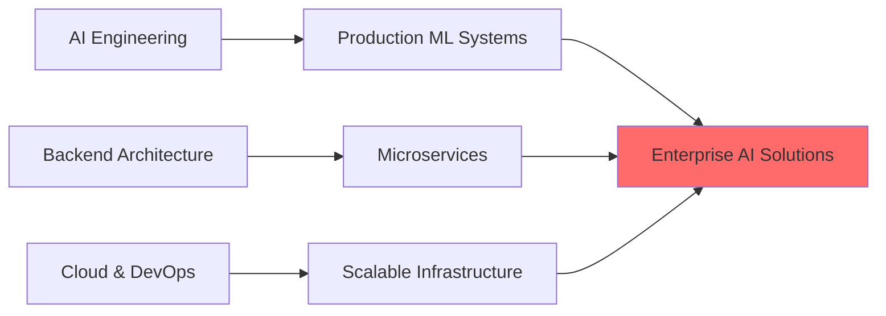

<div align="center">

# 🤖 Syed Owais Ali Shah

### AI Engineer | Backend Developer | Building Intelligent Systems

*Transforming complex problems into intelligent, scalable solutions through AI & modern software engineering*


</div>

---

## 👨‍💻 About Me

I'm a **Software Engineer** specializing in **AI-powered applications** and **scalable backend systems**. With 1-2 years of hands-on experience, I build intelligent solutions that solve real-world problems from conversational AI to financial SaaS platforms.

```yaml
Core Expertise:
  - 🤖 AI/ML Engineering: LLMs, Voice Agent API (VAPI), AI Automation, LangChain
  - ⚙️ Backend Development: NestJS, TypeScript, Scalable REST APIs, RBAC
  - 🚀 SaaS & CRM: Multi-tenant systems, automated billing (Stripe), CRM workflows
  - 🔐 Secure Systems: Post-quantum encryption (Kyber), FPGA acceleration
  - 🎯 Unique Edge: Bridging RISC-V hardware design with high-level software
```
---

### Programming Languages


### Backend & AI


### Databases & Cloud


### Tools & Engineering


---

## 🎯 Current Focus & Learning



**Active Learning:**
- 🔹 Advanced AI agent frameworks (LangGraph, AutoGPT)
- 🔹 Kubernetes & cloud-native architectures
- 🔹 Real-time system optimization & WebSockets
- 🔹 Large-scale distributed system design

---

## 📫 Let's Build Something Amazing

<div align="center">

**Have an interesting problem? Let's solve it together.**

[](mailto:alishahowais@gmail.com)
[](https://www.linkedin.com/in/syedowaisalishah/)
[](mailto:alishahowais@gmail.com)

**📍 Location:** Karachi, Pakistan | **🌍 Remote:** Available worldwide  
**💼 Experience:** 1-2 years shipping AI & backend systems  
**🎓 Education:** Software Engineering @ UIT-NED

</div>

---

<div align="center">

### 💡 "Building intelligent systems that matter, one line of code at a time"


</div>
