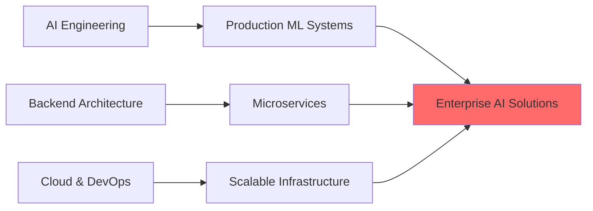

<div align="center">

# 🤖 Syed Owais Ali Shah

### AI Engineer | Backend Developer | Building Intelligent Systems

*Transforming complex problems into intelligent, scalable solutions through AI & modern software engineering*

[](https://www.linkedin.com/in/syedowaisalishah/)
[](mailto:alishahowais@gmail.com)
[](https://github.com/syedowaisalishah)


</div>

---

## 👨‍💻 About Me

I'm a **Software Engineer** specializing in **AI-powered applications** and **scalable backend systems**. With 1-2 years of hands-on experience, I build intelligent solutions that solve real-world problems from conversational AI to financial SaaS platforms.

```yaml
Core Expertise:
  - 🤖 AI/ML Engineering: LLMs, Voice Agent API (VAPI), AI Automation, LangChain
  - ⚙️ Backend Development: NestJS, TypeScript, Scalable REST APIs, RBAC
  - 🚀 SaaS & CRM: Multi-tenant systems, automated billing (Stripe), CRM workflows
  - 🔐 Secure Systems: Post-quantum encryption (Kyber), FPGA acceleration
  - 🎯 Unique Edge: Bridging RISC-V hardware design with high-level software
```

### 🎯 What I Build

**🤖 AI-Powered Applications**
- **Voice Agent API** - Real-time voice bot data ingestion (VAPI) & automated lead management
- **AI CRM Workflows** - Intelligent CRM automation reducing manual reconciliation by ~40%
- **conversion-to-TLV** - AI-assisted code translation for hardware description languages
- **AI Receptionist** - Virtual assistant for automated customer interaction and lead capture

**💼 SaaS & Enterprise Systems**
- **CRM & Backend APIs** - Scalable RESTful services and RBAC for multi-tenant applications
- **Finance Management Platform** - Full-stack SaaS for transaction management and reporting
- **Enigma Chat** - Post-quantum encrypted platform with FPGA-accelerated cryptography
- **Flight Vault** - Aviation data analytics and tracking platform

**🔧 Intelligent Infrastructure**
- **RISC-V Developer Tooling** - Optimized infrastructure and dev-environments (LFX Mentorship)
- **MAGMA-SI** - Optimized matrix operations for AI/ML hardware acceleration
- **Hardware-Aware Software** - Bridging software architecture with low-level hardware constraints

---

### Programming Languages


### Backend & AI


### Databases & Cloud


### Tools & Engineering


---

## 📊 GitHub Analytics

<div align="center">


</div>

<div align="center">


</div>

---

## 🚀 Featured Projects

### 🤖 **AI & Automation**

#### Voice Agent API (EhsaanTech)
*Scalable backend for real-time AI voice agents*
- **Tech:** NestJS, TypeScript, VAPI, MySQL, Git
- **Features:** Integrated VAPI webhooks, real-time call data ingestion, SQL schema optimization
- **Impact:** Handles 1k+ webhook events daily across 5+ client accounts with high observability
- [View Project →](https://github.com/syedowaisalishah/qaulai)

#### conversion-to-TLV (RedwoodEDA)
*AI-assisted hardware translation and automation workflows*
- **Tech:** Python, LLMs, Yosys, Git, Shell
- **Features:** Automated Verilog-to-TL-Verilog conversion, LLM-assisted hardware translation
- **Impact:** Reduced manual debugging effort by ~70% across multiple hardware conversion workflows
- [View Project →](https://github.com/stevehoover/conversion-to-TLV)

---

### 🔧 **Technical Innovation & Security**

#### Enigma Chat (Final Year Project)
*Post-quantum encrypted real-time communication platform*
- **Tech:** Python, JavaScript, SystemVerilog, FPGA, WebRTC
- **Features:** Kyber-based encryption, FPGA-accelerated cryptographic handshakes
- **Impact:** 60% reduction in handshake latency compared to software-only implementation
- [View Project →](https://github.com/syedowaisalishah/EnigmaChat)

---
### 📚 **Other Projects**
**SaaS & Backend:** Finance Management SaaS, CallCenterAI, FamigliaDoro App.  
**Hardware & AI:** NucleusRV, Football Analysis, ChipSimX, DRBG, Bitcoin Protocol Experiments.

---

## 💡 My Unique Value Proposition

**Hardware Background → Software Excellence**

Most software engineers don't understand low-level optimization. Most hardware engineers struggle with scalable software architecture. I bridge both worlds:

✅ **Performance-First Mindset** - Understanding memory hierarchies, CPU caching, parallel processing  
✅ **Full-Stack Thinking** - From algorithm efficiency to system architecture  
✅ **AI Acceleration** - Knowing when and how to optimize for hardware  
✅ **Production-Ready Code** - Not just prototypes, but scalable, maintainable systems  

**Example:** My Enigma Chat platform achieved a **60% reduction in cryptographic latency** by offloading Kyber encryption to a custom FPGA accelerator applying low-level hardware knowledge to solve high-level software bottlenecks.

---

## 🚀 Professional Impact & Key Achievements

- **Scalable Backend Systems**: Architected 15+ REST APIs using NestJS and TypeScript for multi-tenant SaaS platforms.
- **AI & CRM Automation**: Engineered intelligent lead management and CRM workflows, reducing manual reconciliation by **40%**.
- **Financial Engineering**: Developed end-to-end billing systems (Stripe) and automated ledger flows for financial SaaS applications.
- **Secure Communication**: Implemented post-quantum encryption (Kyber) and FPGA-accelerated handshakes for secure real-time chat.
- **Infrastructure & Tooling**: Optimized RISC-V infrastructure and developed AST-based CLI tools during **LFX Mentorship**.
- **Voice AI Solutions**: Integrated VAPI and automated webhooks for real-time AI receptionists and voice agents.
- **Core Engineering**: Accelerated matrix computations by **25%** through hardware/software co-design and optimization.

---

## 🎯 Current Focus & Learning



**Active Learning:**
- 🔹 Advanced AI agent frameworks (LangGraph, AutoGPT)
- 🔹 Kubernetes & cloud-native architectures
- 🔹 Real-time system optimization & WebSockets
- 🔹 Large-scale distributed system design

---

## 🏆 Technical Skills Matrix

| Category | Proficiency | Technologies |
|----------|-------------|--------------|
| **AI/ML Development** | ⭐⭐⭐⭐⭐ | Python, LLMs, OpenAI, LangChain, Prompt Engineering, LoraAi |
| **Backend Engineering** | ⭐⭐⭐⭐⭐ | NestJS, TypeScript, Node.js, Express, Django, FastAPI, RestAPIs |
| **Hardware & Systems** | ⭐⭐⭐⭐ | SystemVerilog, Chisel, RISC-V, Vivado, FPGA Acceleration |
| **Languages** | ⭐⭐⭐⭐⭐ | Python, Ruby, Java, JavaScript, TypeScript, C#, C/C++, Bash |
| **Databases** | ⭐⭐⭐⭐⭐ | PostgreSQL, MySQL, MongoDB, Redis, SQLite, NoSQL |
| **Tools & DevOps** | ⭐⭐⭐⭐ | Docker, Git, CI/CD, Devcontainers, Linux, Rake |

---

## 🚀 Let's Build the Future Together

I am actively seeking **AI Engineer**, **Backend Engineer**, or **Full-Stack** roles where I can leverage my unique hardware-software background to build production-grade intelligent systems.

**What I Bring to Your Team:**
- ✅ **Production Experience** - 1-2 years shipping real-world AI & SaaS products.
- ✅ **Performance Optimization** - Solving high-level bottlenecks with low-level insights.
- ✅ **Full Ownership** - From system architecture to deployment and scaling.
- ✅ **Product Mindset** - Solving business problems, not just writing code.

**What I'm Seeking:**
- 🤖 Roles building production ML systems and AI agents.
- ⚙️ Backend positions in high-growth, scalability-focused startups.
- 💡 Opportunities to bridge the gap between AI and core software infrastructure.

---

## 📫 Let's Build Something Amazing

<div align="center">

**Have an interesting problem? Let's solve it together.**

[](mailto:alishahowais@gmail.com)
[](https://www.linkedin.com/in/syedowaisalishah/)
[](mailto:alishahowais@gmail.com)

**📍 Location:** Karachi, Pakistan | **🌍 Remote:** Available worldwide  
**💼 Experience:** 1-2 years shipping AI & backend systems  
**🎓 Education:** Software Engineering @ UIT-NED

</div>

---

<div align="center">

### 💡 "Building intelligent systems that matter, one line of code at a time"


</div>
